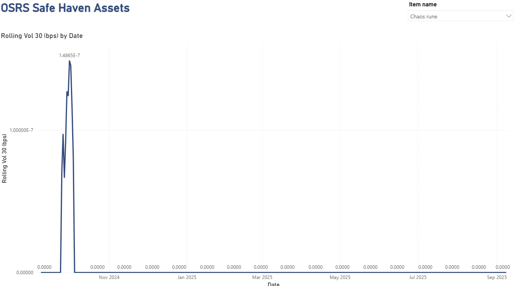
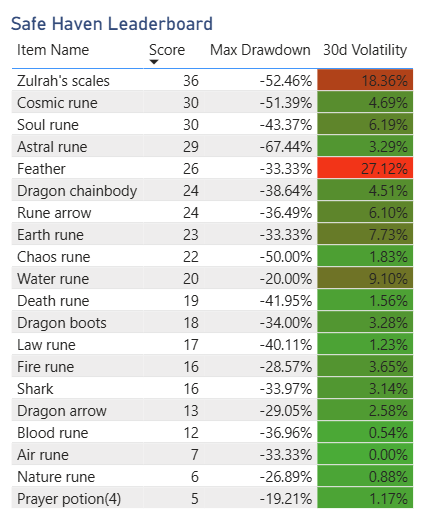

# ⚔️ Oldschool RuneScape Safe Haven Assets
### 🪙 Measuring Volatility and Drawdowns in the Grand Exchange

Which Old School RuneScape items behave like gold during a market crash?  
This project identifies items that act as safe haven assets, holding or gaining value during market stress, using financial analysis techniques.



---

## Project Description
**OSRS Safe Haven Assets** is a full-stack data analytics project built on a fun dataset: the Grand Exchange prices from Old School RuneScape.  

- **Python** for data ingestion, storing OSRS Wiki API data in SQLite  
- **SQL** for returns, drawdowns, and market index modeling  
- **Power BI** for an interactive dashboard with volatility charts and leaderboards  
- **DAX** for volatility, max drawdown, and a composite Safe Haven Score  

This project demonstrates:  
- Data engineering through ETL and pipeline design  
- Time-series and financial-style analysis  
- Data visualization and storytelling with Power BI  
- A creative crossover between gaming economics and financial analytics

---

## Problem
In financial markets, investors look for “safe haven assets” like gold or bonds that hold value during downturns.  
Could similar behavior be found in RuneScape’s Grand Exchange, a player-driven economy with thousands of tradeable items?

---

## Financial Analysis Context
In finance, a market downturn is typically defined as a sustained decline in asset prices, often measured by peak-to-trough drawdowns or broad index losses over time. Downturns can be triggered by many factors, such as shifts in supply and demand, macroeconomic events, or sudden shocks that reduce investor confidence. The result is increased volatility and sharper drawdowns as market participants sell off riskier assets.  

The purpose of this project was to apply those same concepts to a virtual economy, Old School RuneScape’s Grand Exchange. By calculating volatility and drawdowns on in-game items, the analysis highlights which assets behave like safe havens, retaining value when the broader market weakens. This demonstrates how financial analysis techniques can be adapted to unconventional datasets and provides a practical way to connect data engineering, SQL modeling, and visualization skills to real-world economic principles.  

---

## Approach
1. **Data ingestion**  
   - Pulled item mappings and daily price time series from the [OSRS Wiki API](https://prices.runescape.wiki/)  
   - Stored ~500 high-volume items in a local SQLite database  

2. **Data modeling**  
   - SQL views for returns, rolling volatility, drawdowns, and a market index  
   - Exported cleaned CSVs for easy import into Power BI  

3. **Analysis and scoring**  
   - DAX measures for:  
     - Rolling 30-day volatility  
     - Max drawdown  
     - Composite Safe Haven Score (low volatility + shallow drawdown = safer)  

4. **Visualization**  
   - Power BI dashboard with slicers, time-series charts, and leaderboards  
   - Users can filter to a specific item and instantly compare stability  

---

## Solution (Dashboard)
The final dashboard includes:  
- Interactive slicer to choose any tradeable item  
- Rolling volatility chart to see how stable prices are over time  
- Drawdown analysis to measure worst peak-to-trough declines  
- Leaderboard to rank items by Safe Haven Score  

  
*Safe Haven Leaderboard, ranking items by volatility and drawdowns*

---

## Tech Stack
- **Python** — requests, pandas, sqlite3  
- **SQL** — schema, views, and metrics  
- **Power BI** — dashboard visuals  
- **DAX** — financial measures  
- **GitHub Actions** — simple CI linting  

---

## Quickstart
```bash
# Clone repo
git clone https://github.com/YOURUSERNAME/osrs-safe-havens.git
cd osrs-safe-havens

# Set up environment
python -m venv .venv
source .venv/bin/activate  # On Windows: .venv\Scripts\activate
pip install -r requirements.txt

# Ingest data (top 100 most-traded items by default)
python src/ingest.py --db data/osrs.db --items topN --top-n 100 --build-index

# Export for Power BI
python src/export_csvs.py --db data/osrs.db --out data/exports
```
---

## Lessons Learned
- Even in a virtual economy, classic financial metrics (volatility, drawdown) highlight which assets are defensive.  
- Some items (like runes and feathers) behave like safe havens due to constant demand.  
- Building a clean **ETL → SQL → BI pipeline** made analysis reusable and easy to share.  
- Translating finance concepts into a gaming context is a powerful way to learn analytics.

---

## Attribution
- Price data: [OSRS Wiki Prices API](https://prices.runescape.wiki/)  
- RuneScape © Jagex Ltd. This is a fan-made educational project.

---

[LICENSE](https://github.com/SparkerData/OSRS-Safe-Haven-Assets/blob/5c47b7030404697ce8249e71fd264c9d358e4c76/LICENSE)
